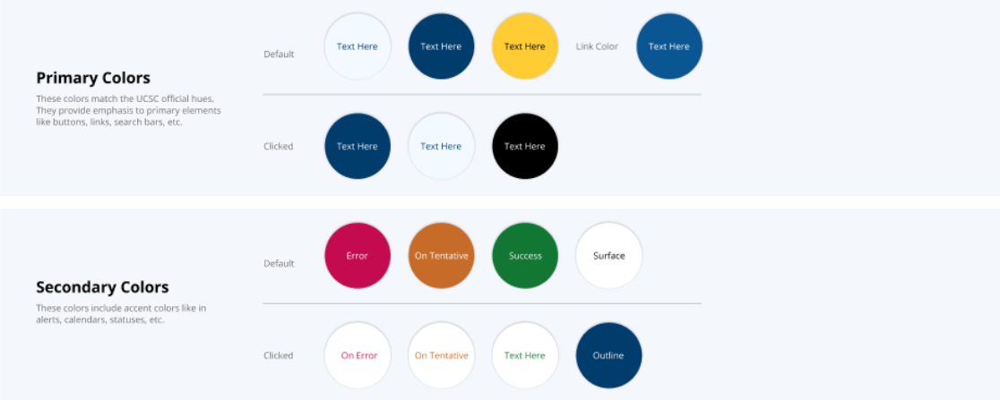
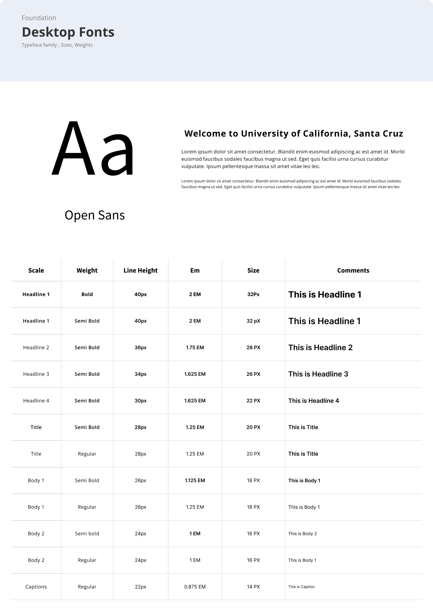
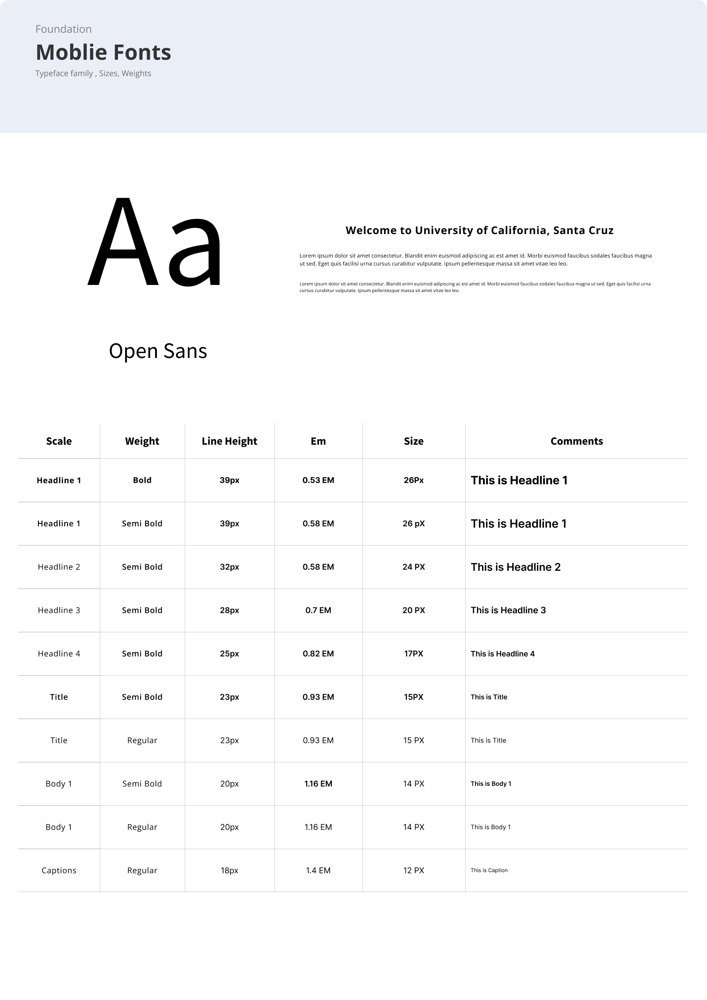
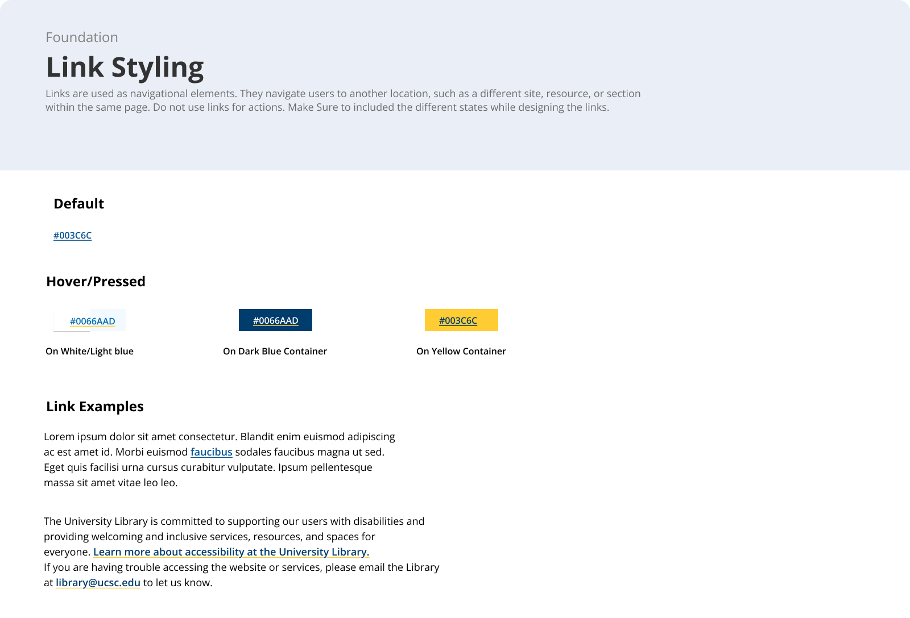
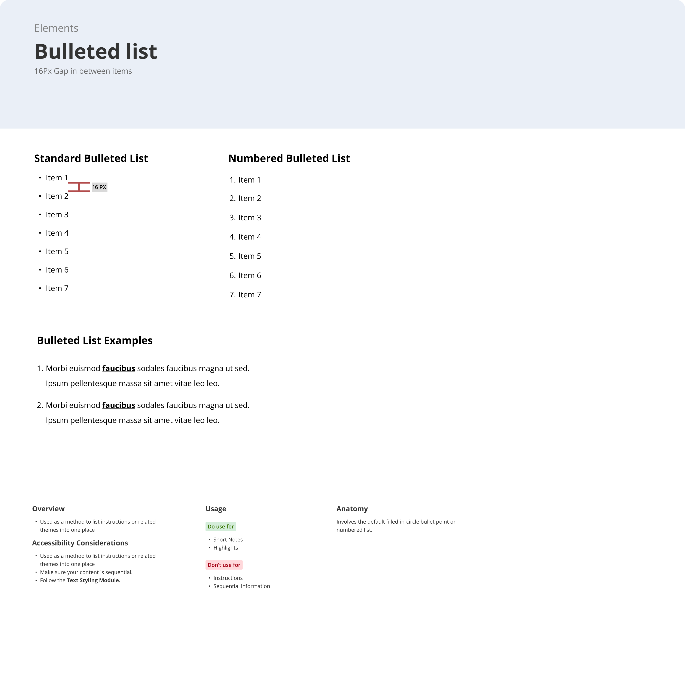

# Design System

## Components

Select a component below to view its docs.

| Component | Docs |
| --- | --- |
| Accordian | [View docs](./accordian/) |
| Button | [View docs](./button/) |
| Cards | [View docs](./card/) |
| Dropdown | [View docs](./dropdown/) |
| Search Bar | [View docs](./search-bar/) |
| Side Tabbed Box | [View docs](./side-tab-box/) |
| Table | [View docs](./table/) |

## Foundations

### Colors

#### Primary colors

| Use | State | Background | Suggested text |
| --- | --- | --- | --- |
| Light blue | Default | `#F3FAFF` | `#003C6C` |
| Light blue | Clicked | `#003C6C` | `#FFFFFF` |
| Dark blue | Default | `#003C6C` | `#FFFFFF` |
| Dark blue | Clicked | `#F3FAFF` | `#003C6C` |
| Yellow | Default | `#FFCC33` | `#000000` |
| Yellow | Clicked | `#000000` | `#FFFFFF` |
| Link | Default | `#0A5692` | `#FFFFFF` |

#### Secondary colors

| Use | State | Background | Suggested text |
| --- | --- | --- | --- |
| Error | Default | `#C50B50` | `#FFFFFF` |
| Error | Clicked | `#FFFFFF` | `#C50B50` |
| Tentative | Default | `#C76C28` | `#FFFFFF` |
| Tentative | Clicked | `#FFFFFF` | `#C76C28` |
| Success | Default | `#117733` | `#FFFFFF` |
| Success | Clicked | `#FFFFFF` | `#117733` |
| Surface | Default | `#FFFFFF` | `#000000` |
| Surface outline | Clicked | `#003C6C` | `#FFFFFF` |

### Typography

### Link Styling

### Lists

