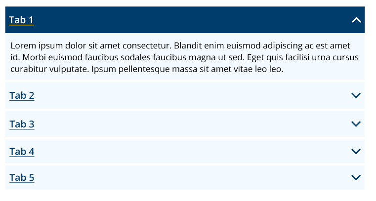

# Accordian

A **Accodian** built with CSS, JQuery and Bootstrap Accordian.

---

## Preview


---

## Usage

Copy & paste the contents of [accordian file](./accordian.html) into a standard libguides box.

The accordian is a slightly modified version of the bootstrap accordian

### Default Active Tab
```html
<div class="panel panel-default">
    <div class="panel-heading active" role="tab" id="headingOne">
        <h4 class="panel-title">
        <a class="collapsed" role="button" data-toggle="collapse" data-parent="#accordion" href="#collapseOne" aria-expanded="false" aria-controls="collapseTwo">
            TAB NAME
        </a>
        <svg xmlns="http://www.w3.org/2000/svg" width="17" height="10" viewBox="0 0 17 10" class="icon active">
            <path d="M16.6258 9.6176C16.3861 9.86245 16.0611 10 15.7222 10C15.3833 10 15.0583 9.86245 14.8186 9.6176L8.49228 3.15257L2.16593 9.6176C1.92488 9.85551 1.60205 9.98716 1.26694 9.98418C0.931843 9.9812 0.611292 9.84385 0.374331 9.60169C0.137369 9.35954 0.0029583 9.03196 4.76837e-05 8.68951C-0.00286484 8.34706 0.125956 8.01715 0.358763 7.77082L7.5887 0.382399C7.82837 0.137549 8.15339 0 8.49228 0C8.83118 0 9.1562 0.137549 9.39587 0.382399L16.6258 7.77082C16.8654 8.01575 17 8.34789 17 8.69421C17 9.04053 16.8654 9.37268 16.6258 9.6176Z"/>
        </svg>
        </h4>
    </div>
    <div id="collapseOne" class="panel-collapse collapse in" role="tabpanel" aria-labelledby="headingOne">
        <div class="panel-body">
            TAB CONTENT
        </div>
    </div>
</div>
```
### Other Tabs
``` html
<div class="panel panel-default">
    <div class="panel-heading" role="tab" id="headingTwo">
        <h4 class="panel-title">
        <a class="collapsed" role="button" data-toggle="collapse" data-parent="#accordion" href="#collapseTwo" aria-expanded="false" aria-controls="collapseTwo">
            TAB NAME
        </a>
        <svg xmlns="http://www.w3.org/2000/svg" width="17" height="10" viewBox="0 0 17 10" class="icon">
            <path d="M0.374196 0.3824C0.613866 0.137549 0.938885 0 1.27778 0C1.61667 0 1.94169 0.137549 2.18136 0.3824L8.50772 6.84743L14.8341 0.3824C15.0751 0.144488 15.398 0.0128441 15.7331 0.0158195C16.0682 0.018795 16.3887 0.156154 16.6257 0.398309C16.8626 0.640464 16.997 0.968042 17 1.31049C17.0029 1.65294 16.874 1.98285 16.6412 2.22918L9.4113 9.6176C9.17163 9.86245 8.84661 10 8.50772 10C8.16882 10 7.8438 9.86245 7.60413 9.6176L0.374196 2.22918C0.134599 1.98425 0 1.65211 0 1.30579C0 0.959466 0.134599 0.627323 0.374196 0.3824Z"/>
        </svg>
        </h4>
    </div>
    <div id="collapseTwo" class="panel-collapse collapse" role="tabpanel" aria-labelledby="headingTwo">
        <div class="panel-body">
            TAB CONTENT
        </div>
    </div>
</div>
```

This should all be wrapped in a 
```html
<div class="panel-group" id="accordion" role="tablist" aria-multiselectable="true">
</div>