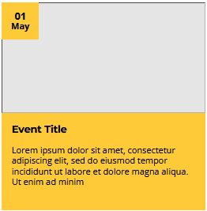
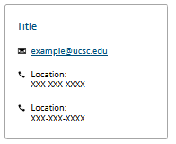

# Cards

Reusable event and contact cards styled to match the design system.

## Event Card

Displays an event image with an overlaid date badge, title, and short
description.

### Preview

### Usage

Copy the contents of [event.html](./event.html) into the target LibGuide, then
replace the following placeholder content:

- Add the event image URL to the empty `src` attribute and provide descriptive
  alternative text.
- Update the visible day and month, as well as the machine-readable `datetime`
  value.
- Replace the event title and description.

## Contact Card

Displays a linked contact title, email address, and location phone numbers.

### Preview

### Usage

Copy the contents of [contact.html](./contact.html) into the target LibGuide,
then replace the following placeholder content:

- Update the title text and its destination link.
- Replace both the visible email address and its `mailto:` link.
- Replace each location label and phone number. Remove or duplicate contact
  rows as needed.
