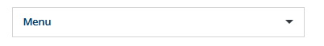
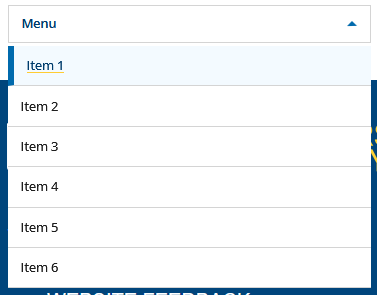

# Dropdown

A **Dropdown menu** styled to match the design system and built with Bootstrap 5.

---

## Preview

### Closed

### Open

---

## Usage

Copy and paste the contents of the [dropdown file](./dropdown.html) into the target LibGuide.

Change the button label and menu item text and links as needed. The dropdown requires Bootstrap 5's JavaScript for its open and close behavior.
